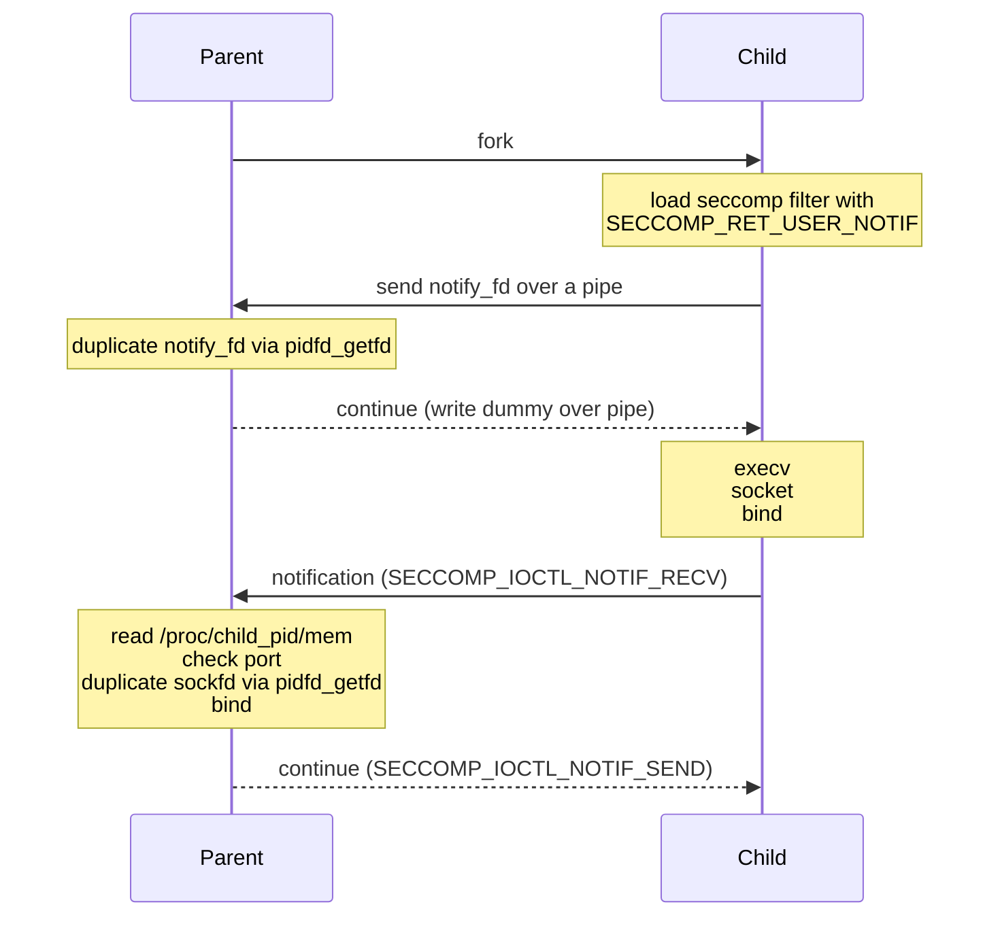

# port-restricter

This program spawns a child process and only allows it to bind to a specific
IPv4/IPv6 port.

## Runtime requirements
Linux kernel >= 5.6 (uses `pidfd_getfd`)

## Example usage
Here's an example using netcat. If we tell port-restricter to only allow port
5000, and tell netcat to listen on port 5001, then netcat will get an EPERM
error when it calls bind():
```bash
./port-restricter -p 5000 -- nc -l 0.0.0.0 5001
# nc: Operation not permitted

./port-restricter -p 5000 -- nc -l 0.0.0.0 5000
# Executes normally
```

## Build from source
Make sure to install the libseccomp development files (`libseccomp-dev` on
Debian/Ubuntu, `libseccomp-devel` on Fedora).

Then run `make`.

## How it works
This parent process uses the [seccomp_unotify(2)](https://manpages.debian.org/stable/manpages-dev/seccomp_unotify.2.en.html)
API (available since Linux 5.0) to get notified whenever the child process
calls `bind`, then reads the child process' memory to determine which port was
requested. If the requested port is equal to the target port, then the parent
calls uses `pidfd_getfd` to get a duplicate of the child's socket fd, calls
`bind` with this new fd and the desired address + port, and returns 0 to the
child if everything succeeds.


